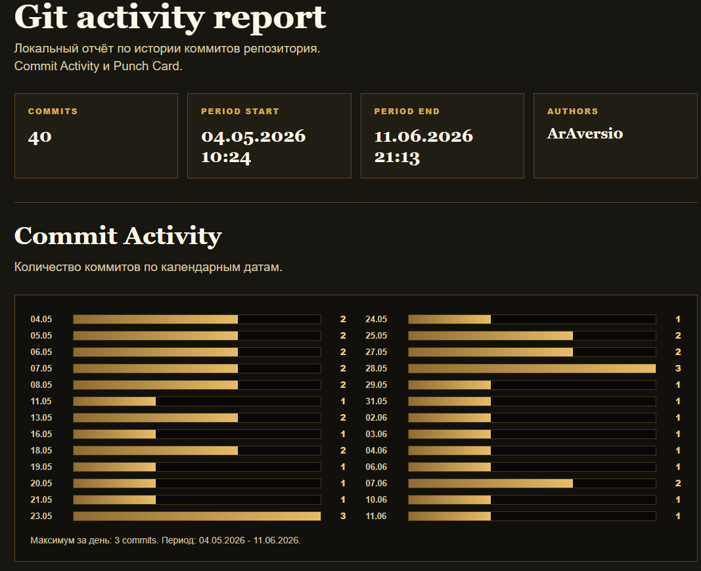
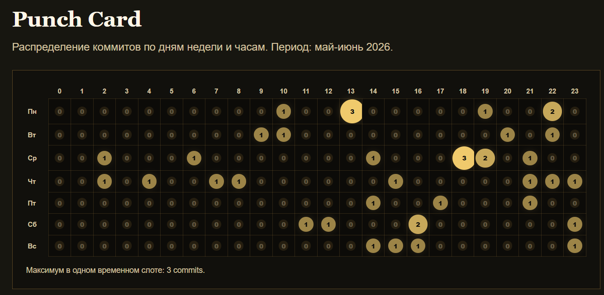

# PfP Companion System

**PfP Companion System** - enterprise-приложение для ведения персонажей, правил и лора собственной настольной ролевой системы **PfP (Pain for Pleasure)**. Проект объединяет веб-клиент, desktop-клиент, backend API, PostgreSQL-хранилище, админский контур и общий модуль игровых правил.

Главная цель проекта - дать игрокам и мастеру единое рабочее пространство: создавать листы персонажей, редактировать игровые параметры, вести инвентарь и заклинания, импортировать и экспортировать JSON, читать справочник правил и лор, а также синхронизировать персонажей между веб-версией и desktop-приложением через один аккаунт.

## Возможности

- Регистрация, вход по email/паролю, подтверждение email через dev-почту Mailpit.
- Вход через Google OAuth2.
- JWT-аутентификация и разграничение ролей пользователя и администратора.
- Веб-архив персонажей с лимитом 100 листов на аккаунт.
- Desktop-режим гостя с локальным JSON-хранилищем и лимитом 30 листов.
- Desktop-режим аккаунта с синхронизацией персонажей через backend API.
- Полноценный лист персонажа PfP: портрет, базовая информация, характеристики, навыки, здоровье по частям тела, экипировка, инвентарь, заклинания, заметки и дополнительные сведения.
- Drag-and-drop инвентаря, создание предмета через пустую ячейку, экипировка, снятие экипировки, продажа торговых предметов.
- Импорт и экспорт персонажей в JSON в веб-версии и desktop-версии.
- Read-only справочник правил и лора в desktop-приложении.
- Редактирование лора и справочника правил через web admin.
- Админская панель для управления пользователями, просмотра персонажей пользователей и редактирования контента.
- Desktop-настройки: разрешение окна, оконный/полноэкранный режим, горячие клавиши, музыка и звуки.
- Desktop-сборка в self-contained app image через `jpackage`; подготовлена задача для Windows installer.

## Архитектура

Проект оформлен как монорепозиторий:

```text
apps/
  backend/   Spring Boot backend API
  web/       React + TypeScript + Vite web client
  desktop/   JavaFX desktop client
libs/
  game-rules/ shared PfP rules and calculations
infra/
  compose.yaml PostgreSQL and Mailpit for local development
docs/
  project documentation
contracts/
  API and data contracts
```

Backend построен по модульной структуре PCMEF: `control`, `mediator`, `entity`, `foundation`, `sharedkernel`. Основные домены: `charactersheet`, `charactertransfer`, `content`, `identityaccess`, `notification`.

Web-клиент использует feature-based структуру: `auth`, `character-sheet`, `character-transfer`, `content`, `admin`. Desktop-клиент использует JavaFX и разделён на `control`, `foundation`, `presentation`, `statemanagement`.

## Стек технологий

Backend:

- Java 17
- Spring Boot 3
- Spring Web, Validation, Security
- Spring Data JPA
- PostgreSQL
- Flyway
- JWT / OAuth2 Client / OAuth2 Resource Server
- Spring Mail
- JUnit 5, Mockito, Testcontainers
- JaCoCo

Frontend:

- React 18
- TypeScript
- Vite
- React Router
- React Hook Form
- Axios
- ESLint

Desktop:

- Java 17
- JavaFX
- Gradle Application Plugin
- `jpackage`
- локальное JSON-хранилище для гостевого режима
- встроенные ресурсы лора, справочника, музыки, звуков и изображений листа

Infrastructure:

- Docker Compose
- PostgreSQL
- Mailpit

## Локальный запуск

### Полный стек через Docker Compose

Одна команда для сборки backend jar, сборки web-клиента и запуска всех контейнеров:

```powershell
.\infra\start-stack.ps1
```

Скрипт поднимает PostgreSQL, Mailpit, backend API и web-клиент через Docker Compose. Web-клиент доступен на `http://localhost:5173`, backend - на `http://localhost:8080`, Mailpit UI - на `http://localhost:8025`.

Для JWT и Google OAuth2 используется локальный `.env`, который не коммитится. Создайте его из шаблона и заполните реальные значения самостоятельно:

```powershell
Copy-Item .env.example .env
notepad .env
```

Минимально для стабильных JWT нужен `PFP_JWT_SECRET` длиной не меньше 32 байт. Для Google OAuth2 заполните `PFP_GOOGLE_CLIENT_ID` и `PFP_GOOGLE_CLIENT_SECRET`; в Google Cloud Console добавьте Authorized redirect URI: `http://localhost:8080/login/oauth2/code/google`. После изменения `.env` перезапустите стек командой `.\infra\start-stack.ps1`.

Если backend jar и `apps/web/dist` уже собраны, можно запустить только контейнеры:

```powershell
docker compose -f infra/compose.yaml up -d --build
```

### Инфраструктура

```powershell
docker compose -f infra/compose.yaml up -d postgres mailpit
```

PostgreSQL доступен на `localhost:5432`, Mailpit UI - на `http://localhost:8025`.

### Backend

```powershell
$env:JAVA_HOME="C:\Users\user\.jdks\corretto-23.0.2"
.\gradlew.bat :apps:backend:bootRun
```

Backend запускается на `http://localhost:8080`.

### Web

```powershell
cd apps\web
npm install
npm run dev -- --host 127.0.0.1
```

Web-клиент открывается на `http://localhost:5173`.

### Desktop

```powershell
$env:JAVA_HOME="C:\Users\user\.jdks\corretto-23.0.2"
.\gradlew.bat :apps:desktop:run
```

Для режима аккаунта desktop-клиенту нужен запущенный backend. Гостевой режим работает локально без backend.

## Сборка и проверка

Backend tests + JaCoCo:

```powershell
$env:JAVA_HOME="C:\Users\user\.jdks\corretto-23.0.2"
.\gradlew.bat :apps:backend:test --console=plain
```

HTML-отчёт JaCoCo:

```text
apps/backend/build/reports/jacoco/test/html/index.html
```

Desktop tests:

```powershell
$env:JAVA_HOME="C:\Users\user\.jdks\corretto-23.0.2"
.\gradlew.bat :apps:desktop:test --console=plain
```

Web build:

```powershell
cd apps\web
npm run build
```

Статический анализ и сводка проверок:

```text
docs/06-implementation/static-analysis.md
```

Desktop app image:

```powershell
$env:JAVA_HOME="C:\Users\user\.jdks\corretto-23.0.2"
.\gradlew.bat :apps:desktop:packageDesktopAppImage --console=plain
```

Готовое приложение создаётся в:

```text
apps/desktop/build/jpackage/image/PfP Companion/
```

Windows installer:

```powershell
$env:JAVA_HOME="C:\Users\user\.jdks\corretto-23.0.2"
.\gradlew.bat :apps:desktop:packageDesktopInstaller --console=plain
```

Для `.exe` installer на Windows требуется установленный WiX Toolset. Без WiX можно использовать self-contained app image.

## Статистика разработки

В ходе разработки велась локальная история коммитов. Ниже приведены скриншоты активности, подготовленные по истории репозитория.

### Метрики Git

- Основной этап разработки: 40 коммитов
- Период основной разработки: 04.05.2026 - 11.06.2026
- Средняя частота: около 1.0 коммита в календарный день и 1.5 коммита в активный день

Полный набор скриншотов интерфейса расположен в [docs/07-ui/screenshots.md](docs/07-ui/screenshots.md).

### Commit Activity



### Punch Card



## Текущее состояние

Веб-часть и desktop-часть доведены до MVP+ уровня: реализованы основные пользовательские сценарии, синхронизация персонажей аккаунта, локальный гостевой режим, дополнительный контент в режиме только для чтения, админский контур, сборка и проверка тестами. Для промышленной эксплуатации остаются задачи по промышленной email-доставке, удобному назначению администраторов, CI/CD и выпуску подписанного desktop-установщика.

