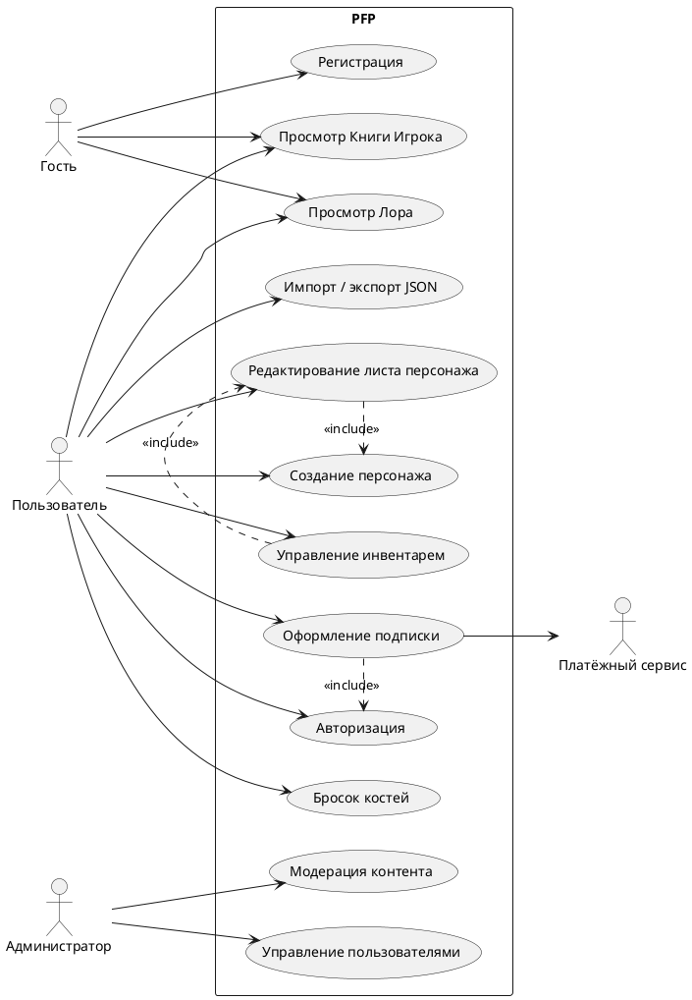

# BUC-диаграмма

---

## Описание BUC-диаграммы

BUC-диаграмма отражает ключевые бизнес-прецеденты системы и показывает, какие роли участвуют в работе с платформой PFP.

Гость может просматривать публичный контент и работать в локальном режиме desktop-версии. Зарегистрированный пользователь получает доступ к созданию и редактированию персонажей, управлению инвентарем, виртуальным броскам костей, импорту и экспорту JSON. Администратор отвечает за модерацию контента и управление пользователями. Прецедент «Оформление подписки» включает авторизацию и обращение к внешнему платёжному сервису.