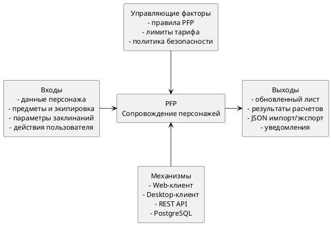

# Диаграмма бизнес-контекста IDEF0 A-0

---

## Описание бизнес-контекста

| Элемент | Содержание |
| --- | --- |
| Основная функция | Ведение и сопровождение персонажей настольно-ролевой системы PFP |
| Входы | Данные персонажа, предметы, параметры заклинаний, текстовые заметки, действия пользователя |
| Выходы | Обновленный лист, результаты автоматических расчётов, JSON-файлы экспорта, уведомления интерфейса |
| Управляющие факторы | Правила системы PFP, ограничения тарифа, политики безопасности и модерации |
| Исполнители | Игрок, мастер игры, администратор, веб-клиент, desktop-клиент, серверное приложение |