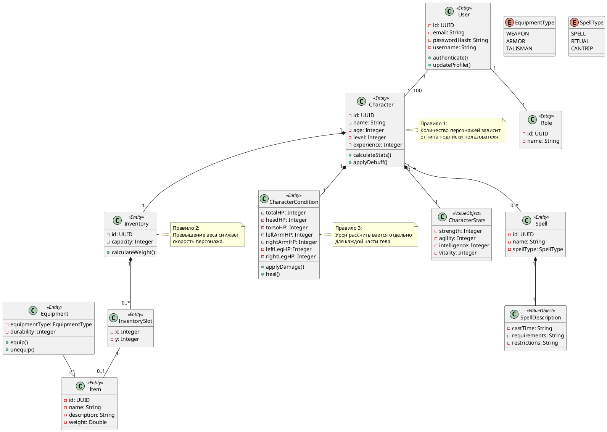

# Диаграмма предметной модели

## Описание предметной модели

### 1. Общая характеристика модели

Модель предметной области системы сопровождения персонажей PFP представляет собой структурированное описание ключевых сущностей, их атрибутов, взаимосвязей и бизнес-правил. Она построена на основе принципов Domain-Driven Design и отражает логику работы системы на уровне данных и поведения объектов.

В модели выделяются следующие типы элементов:

- **Сущности (Entity)** — объекты с уникальной идентичностью и жизненным циклом;
- **Объекты-значения (Value Object)** — неизменяемые структуры данных без идентичности;
- **Перечисления (Enum)** — фиксированные наборы допустимых значений.

Центральным элементом модели является сущность **Character**, вокруг которой организованы остальные компоненты.

---

### 2. Ключевые сущности

#### Character

Сущность `Character` является агрегатным корнем и представляет игрового персонажа.

Основные функции:
- хранение базовых данных персонажа;
- управление связанными сущностями;
- выполнение бизнес-логики (расчёт характеристик, применение эффектов).

Связанные сущности:
- CharacterStats
- CharacterCondition
- Inventory

---

#### User и Role

Сущность `User` представляет пользователя системы и содержит:
- идентификационные данные;
- данные для аутентификации;
- профиль пользователя.

Сущность `Role` определяет уровень доступа:
- ROLE_GUEST
- ROLE_USER
- ROLE_ADMIN

Связи:
- один пользователь имеет одну роль;
- один пользователь может управлять несколькими персонажами.

---

#### Inventory и InventorySlot

`Inventory` представляет инвентарь персонажа и реализует grid-based модель хранения.

Функции:
- хранение предметов;
- контроль вместимости;
- расчёт общего веса.

`InventorySlot`:
- задаёт координаты (x, y);
- может содержать один предмет.

---

#### Item и Equipment

`Item` — базовая сущность предмета:
- название;
- описание;
- вес.

`Equipment`:
- является расширением Item;
- добавляет:
  - тип экипировки;
  - прочность;
- влияет на характеристики персонажа.

---

#### CharacterCondition

Сущность `CharacterCondition` отвечает за состояние персонажа:

Содержит:
- общее HP;
- локальное HP частей тела:
  - голова;
  - торс;
  - руки;
  - ноги.

Функции:
- применение урона;
- лечение;
- распределение урона.

---

#### Spell и SpellDescription

`Spell` — сущность заклинания.

`SpellDescription` — объект-значение, содержащий:
- требования;
- ограничения;
- время применения;
- описание.

Такое разделение позволяет отделить идентичность заклинания от его параметров.

---

### 3. Объекты-значения (Value Objects)

#### CharacterStats

Содержит базовые характеристики:
- сила;
- ловкость;
- интеллект;
- выносливость.

Особенности:
- не имеет идентичности;
- полностью определяется значениями полей;
- используется внутри Character.

---

#### SpellDescription

Определяет параметры заклинания:
- условия применения;
- ограничения;
- описание.

Является неизменяемым объектом.

---

### 4. Перечисления (Enum)

#### EquipmentType

Определяет тип экипировки:
- WEAPON
- ARMOR
- TALISMAN

---

#### SpellType

Определяет тип заклинания:
- SPELL
- RITUAL
- CANTRIP

---

### 5. Связи между сущностями

В модели используются следующие типы связей:

#### Композиция (Composition)

- Character → CharacterStats  
- Character → CharacterCondition  
- Character → Inventory  

(зависимый жизненный цикл)

- Inventory → InventorySlot  

---

#### Ассоциации (Association)

- InventorySlot → Item  
- Character → Spell  

---

#### Наследование (Inheritance)

- Equipment → Item  

---

#### Связь пользователя и персонажа

- User → Character (один ко многим)

---

### 6. Бизнес-правила и ограничения

В модели зафиксированы следующие бизнес-правила:

1. Количество персонажей ограничено типом подписки пользователя.
2. Offline-режим доступен только для ROLE_GUEST (desktop).
3. Превышение веса инвентаря снижает скорость персонажа.
4. Урон рассчитывается отдельно для каждой части тела.
5. Экипировка применяется к соответствующим body zones.
6. Характеристики автоматически пересчитываются при изменении экипировки.

---

### 7. Итог

Разработанная предметная модель:

- формализует предметную область системы;
- задаёт основу для проектирования базы данных;
- определяет структуру backend-логики;
- обеспечивает единый язык между участниками разработки.

Модель используется как фундамент для дальнейших этапов проектирования системы, включая разработку API, архитектуры и реализации бизнес-логики.
