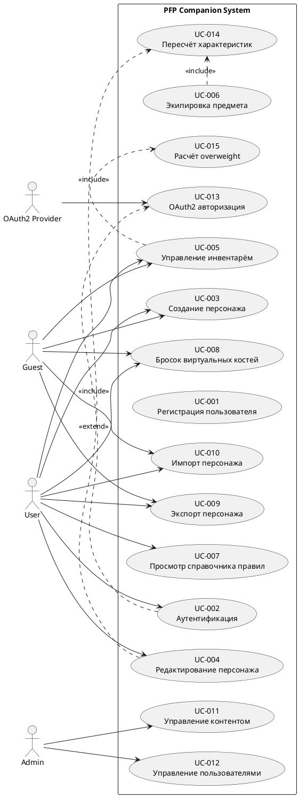

# Use-case диаграмма

## Описание

Диаграмма вариантов использования отражает ключевые сценарии взаимодействия пользователей с системой сопровождения персонажей PFP и демонстрирует переход от бизнес-процессов к системной функциональности. 
В качестве акторов выделены роли:

+ ["software_role","ROLE_GUEST","unauthorized user role"],
+ ["software_role","ROLE_USER","authorized user role"]
+ ["software_role","ROLE_ADMIN","administrator role"], 
+ А также внешняя система аутентификации ["software_system","OAuth2 Provider","external auth system"].

Основной функционал сосредоточен вокруг управления персонажем, инвентарём и игровыми механиками: создание и редактирование персонажа, работа с инвентарём и экипировкой, выполнение виртуальных бросков костей, импорт и экспорт данных. Администратор отвечает за управление пользователями и контентом системы.

Диаграмма также отражает внутреннюю логику системы через отношения <<include>> и <<extend>>. Связи <<include>> используются для обязательных вычислений (например, пересчёт характеристик и расчёт overweight), а <<extend>> — для расширения базовых сценариев, таких как авторизация через OAuth2.

Таким образом, диаграмма фиксирует структуру системных требований и показывает, каким образом пользователи взаимодействуют с системой в рамках ключевых бизнес-задач.