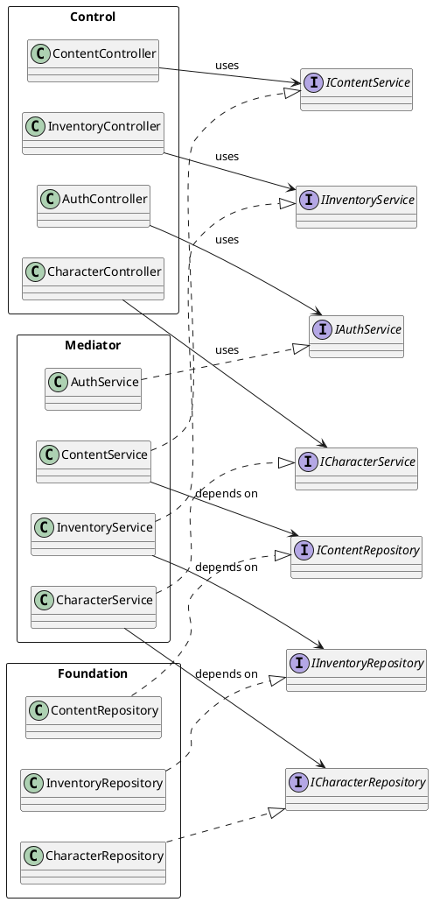

# Диаграмма зависимостей



---

## Интерфейсы архитектурных слоёв

### Общая информация

В архитектуре проекта PFP взаимодействие между слоями реализуется через набор формализованных интерфейсов. Использование интерфейсов позволяет уменьшить связанность компонентов, обеспечить соблюдение принципа Dependency Inversion и повысить тестируемость системы.

На текущем этапе проектирования определены следующие основные группы интерфейсов:

1. Интерфейсы между слоем Control и слоем Mediator.
2. Интерфейсы между слоем Mediator и слоем Foundation.
3. Интерфейсы взаимодействия клиентов с REST API.
4. Интерфейсы безопасности.
5. Интерфейсы локального хранения данных для Desktop Client.

---

## Control → Mediator

### Назначение

Данные интерфейсы используются контроллерами для обращения к бизнес-логике системы.

Контроллеры не должны зависеть от конкретной реализации сервисов. Вместо этого они работают через абстрактные сервисные контракты.

Такой подход обеспечивает:

- слабую связанность слоёв;
- упрощённое тестирование контроллеров;
- возможность замены реализации сервиса без изменения контроллера.

---

### CharacterService

#### Назначение

Управление жизненным циклом персонажей и выполнение связанных игровых расчётов.

#### Основные операции

```java
public interface CharacterService {

    CharacterResponse createCharacter(CharacterRequest request);

    CharacterResponse updateCharacter(
        Long id,
        CharacterRequest request
    );

    CharacterResponse getCharacterById(Long id);

    List<CharacterResponse> getUserCharacters(Long userId);

    void deleteCharacter(Long id);

    CharacterStats calculateStats(Long characterId);

    CharacterMovement calculateMovement(Long characterId);
}
```

---

### InventoryService

#### Назначение

Управление инвентарём персонажа.

#### Основные операции

```java
public interface InventoryService {

    InventoryResponse getInventory(Long characterId);

    void addItem(Long characterId, Long itemId);

    void removeItem(Long characterId, Long itemId);

    void moveItem(
        Long sourceSlotId,
        Long targetSlotId
    );

    void equipItem(
        Long characterId,
        Long itemId
    );

    void unequipItem(
        Long characterId,
        Long itemId
    );
}
```

---

### RuleBookService

#### Назначение

Предоставление доступа к игровым правилам и справочной информации.

#### Основные операции

```java
public interface RuleBookService {

    List<RuleBookArticleResponse> getArticles();

    RuleBookArticleResponse getArticle(Long id);

    List<RuleCategoryResponse> getCategories();
}
```

---

## Mediator → Foundation

### Назначение

Сервисы обращаются к данным через репозиторные интерфейсы.

Бизнес-логика не зависит от конкретного механизма хранения данных.

Преимущества:

- независимость от PostgreSQL;
- возможность замены persistence-слоя;
- удобство модульного тестирования.

---

### CharacterRepository

#### Назначение

Доступ к данным персонажей.

#### Основные операции

```java
public interface CharacterRepository {

    Optional<Character> findById(Long id);

    List<Character> findByOwnerId(Long ownerId);

    Character save(Character character);

    void deleteById(Long id);

    boolean existsByName(String name);
}
```

---

### InventoryRepository

#### Назначение

Работа с инвентарём персонажей.

#### Основные операции

```java
public interface InventoryRepository {

    Optional<Inventory> findById(Long id);

    Inventory save(Inventory inventory);

    Optional<Inventory> findByCharacterId(Long characterId);
}
```

---

### ItemRepository

#### Назначение

Работа с игровыми предметами.

#### Основные операции

```java
public interface ItemRepository {

    Optional<Item> findById(Long id);

    List<Item> findAll();

    Item save(Item item);
}
```

---

## Client → REST API

### Назначение

Клиентские приложения взаимодействуют с сервером исключительно через REST API.

В качестве транспортного протокола используется HTTPS.

Формат обмена данными:

```text
HTTPS + JSON
```

---

### CharacterApi

#### Назначение

Удалённое управление персонажами.

#### Основные операции

```typescript
export interface CharacterApi {

    getCharacter(
        id: number
    ): Promise<CharacterResponse>;

    createCharacter(
        request: CharacterRequest
    ): Promise<CharacterResponse>;

    updateCharacter(
        id: number,
        request: CharacterRequest
    ): Promise<CharacterResponse>;

    deleteCharacter(
        id: number
    ): Promise<void>;
}
```

---

### InventoryApi

#### Назначение

Удалённое управление инвентарём.

### Основные операции

```typescript
export interface InventoryApi {

    getInventory(
        characterId: number
    ): Promise<InventoryResponse>;

    equipItem(
        characterId: number,
        itemId: number
    ): Promise<void>;

    unequipItem(
        characterId: number,
        itemId: number
    ): Promise<void>;
}
```

---

## Security Interfaces

### Назначение

Обеспечение аутентификации и авторизации пользователей.

Используемые механизмы:

- JWT Authentication;
- OAuth2 Authorization;
- Role-Based Access Control (RBAC).

---

### AuthenticationService

```java
public interface AuthenticationService {

    AuthResponse login(
        LoginRequest request
    );

    AuthResponse refreshToken(
        String refreshToken
    );

    void logout(Long userId);
}
```

---

### OAuth2Provider

```java
public interface OAuth2Provider {

    OAuthUserInfo getUserInfo(
        String accessToken
    );
}
```

---

## Desktop Local Cache Interfaces

### Назначение

Поддержка автономного режима работы Desktop Client.

Данные интерфейсы используются исключительно в JavaFX-клиенте.

---

### LocalCharacterStorage

```java
public interface LocalCharacterStorage {

    void save(CharacterDto character);

    Optional<CharacterDto> load(Long id);

    List<CharacterDto> loadAll();

    void delete(Long id);
}
```

---

## Карта зависимостей интерфейсов

```text
Web Client
      │
      ▼
CharacterApi
      │
      ▼
CharacterController
      │
      ▼
CharacterService
      │
      ▼
CharacterRepository
      │
      ▼
PostgreSQL
```

Аналогичный принцип используется для всех остальных бизнес-модулей системы.

---

## Принципы использования интерфейсов

В проекте PFP все интерфейсы проектируются с соблюдением следующих принципов:

- Dependency Inversion Principle (DIP);
- Interface Segregation Principle (ISP);
- отсутствие циклических зависимостей;
- разделение ответственности между слоями;
- независимость бизнес-логики от инфраструктуры;
- возможность модульного тестирования каждого слоя отдельно.

Использование интерфейсных контрактов позволяет поддерживать архитектуру PCMEF в согласованном состоянии и обеспечивает возможность дальнейшего масштабирования системы без нарушения существующих зависимостей.