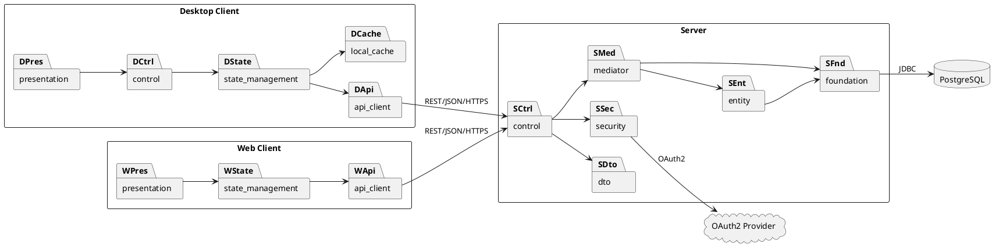

# PCMEF-диаграмма



---

## PCMEF-модель архитектуры проекта PFP

### Общая характеристика

Архитектура системы сопровождения персонажей настольно-ролевой системы PFP построена на основе паттерна **PCMEF (Presentation – Control – Mediator – Entity – Foundation)**, адаптированного под enterprise-конфигурацию с несколькими клиентскими приложениями и централизованным сервером.

Выбор PCMEF обусловлен необходимостью разделения пользовательского интерфейса, бизнес-логики и инфраструктурных компонентов. Такой подход обеспечивает высокую тестируемость системы, упрощает сопровождение кода и позволяет независимо развивать различные части приложения.

В рамках проекта PFP архитектура реализована как **modular monolith**, в котором все серверные компоненты работают внутри единого Spring Boot приложения, а взаимодействие клиентов с системой осуществляется через REST API.

---

### Presentation Layer

Слой Presentation отвечает за взаимодействие пользователя с системой.

В проекте PFP данный слой представлен двумя независимыми клиентскими приложениями:

- Web Client (React + TypeScript);
- Desktop Client (JavaFX).

Основные обязанности слоя:

- отображение игровых данных;
- отображение листов персонажей;
- работа с интерфейсом инвентаря;
- отображение справочников правил;
- навигация между экранами;
- отправка пользовательских действий на сервер.

Слой Presentation не содержит бизнес-логики и не выполняет вычислений игровых параметров. Его задачей является получение данных от пользователя и отображение результатов работы системы.

---

### Control Layer

Слой Control реализован на сервере посредством REST-контроллеров Spring Boot.

Контроллеры являются точкой входа во все серверные сценарии системы.

Основные обязанности слоя:

- приём HTTP-запросов;
- проверка корректности входных данных;
- преобразование DTO;
- маршрутизация запросов к сервисам;
- возврат ответов клиентам.

Примеры компонентов слоя:

- AuthController;
- CharacterController;
- InventoryController;
- RuleBookController;
- AdminController.

Контроллеры не реализуют бизнес-логику и выступают исключительно координаторами запросов.

---

### Mediator Layer

Mediator является центральным слоем архитектуры и содержит бизнес-логику системы.

Именно здесь реализуются игровые правила и алгоритмы сопровождения персонажей.

Основные обязанности слоя:

- создание и изменение персонажей;
- автоматический пересчёт характеристик;
- расчёт переносимого веса (Overweight);
- обработка экипировки;
- управление инвентарём;
- обработка игровых условий и состояний;
- контроль выполнения бизнес-правил.

Примеры компонентов слоя:

- CharacterService;
- InventoryService;
- EquipmentService;
- RuleBookService;
- AuthService.

Данный слой обеспечивает независимость предметной логики от пользовательского интерфейса и инфраструктурных технологий.

---

### Entity Layer

Entity Layer содержит доменную модель предметной области.

Сущности описывают бизнес-объекты и их состояние.

Основные сущности системы:

#### Пользователи

- User;
- Role.

#### Персонажи

- Character;
- CharacterCondition;
- CharacterMovement;
- CharacterStats;
- Level;
- Origin;
- Background.

#### Инвентарь

- Inventory;
- InventorySlot;
- Item;
- Equipment;
- TradeItem.

#### Магия

- Spell;
- SpellDescription.

#### Контент

- LoreArticle;
- RuleBookArticle;
- RuleCategory.

Особенностью доменной модели является поддержка механик PFP:

- локальный урон по частям тела;
- экипировка по зонам тела;
- расчёт перегрузки персонажа;
- зависимость скорости от переносимого веса.

---

### Foundation Layer

Foundation Layer отвечает за взаимодействие системы с внешними источниками данных.

В проекте слой реализован через Spring Data JPA и инфраструктурные компоненты.

Основные обязанности слоя:

- работа с PostgreSQL;
- выполнение CRUD-операций;
- хранение персонажей;
- хранение пользовательских данных;
- управление транзакциями хранения.

Примеры компонентов:

- UserRepository;
- CharacterRepository;
- InventoryRepository;
- ItemRepository;
- SpellRepository.

Данный слой полностью изолирует бизнес-логику от особенностей конкретной базы данных.

---

### Дополнительные архитектурные слои

#### DTO Layer

DTO Layer используется для передачи данных между клиентом и сервером.

Назначение:

- изоляция внутренней модели от API;
- сериализация JSON;
- поддержка стабильных контрактов REST API.

Примеры:

- CharacterRequest;
- CharacterResponse;
- InventoryResponse;
- AuthResponse.

---

#### Security Layer

Security Layer обеспечивает безопасность системы.

Используемые технологии:

- Spring Security;
- JWT;
- OAuth2.

Основные задачи:

- аутентификация пользователей;
- авторизация по ролям;
- защита REST API;
- интеграция с внешними OAuth2-провайдерами.

---

#### Local Cache Layer

Данный слой используется только Desktop Client.

Назначение:

- поддержка offline mode;
- локальное хранение персонажей;
- импорт и экспорт данных в формате JSON.

Благодаря Local Cache пользователь может работать с персонажами даже при отсутствии подключения к серверу.

---

### Правило зависимостей

В архитектуре PFP действует основное правило PCMEF:

```text
Presentation
      ↓
Control
      ↓
Mediator
     ↙ ↘
 Entity Foundation
          ↓
      PostgreSQL
```

Зависимости направлены только сверху вниз.

Запрещены следующие типы связей:

- Foundation → Mediator;
- Entity → Control;
- Foundation → Presentation;
- циклические зависимости между пакетами.

Для уменьшения связанности используются:

- интерфейсы сервисов;
- интерфейсы репозиториев;
- dependency injection;
- DTO;
- REST-контракты.

---

### Результат применения PCMEF

Использование архитектурного паттерна PCMEF позволило получить модульную и расширяемую архитектуру, обеспечивающую:

- разделение ответственности между компонентами;
- независимое развитие клиентов и сервера;
- высокую тестируемость бизнес-логики;
- упрощение сопровождения проекта;
- возможность дальнейшего масштабирования системы;
- соответствие требованиям enterprise-разработки.