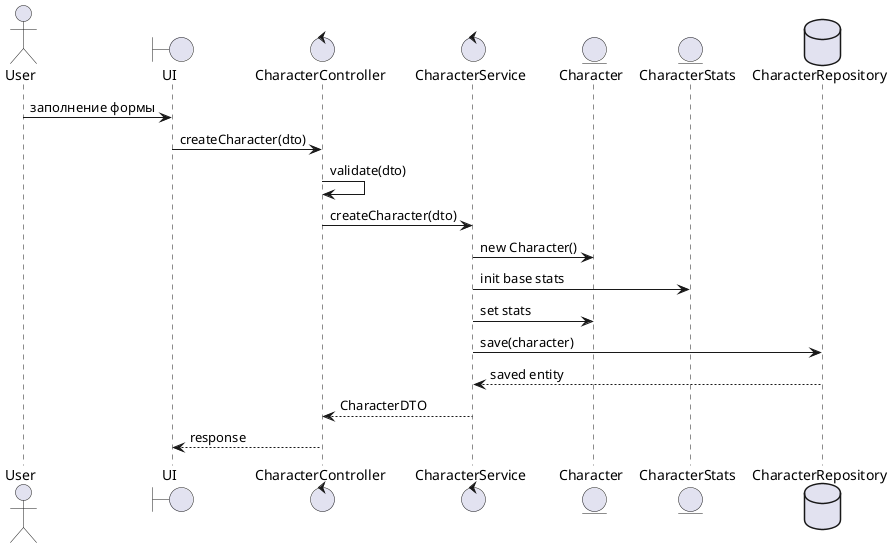
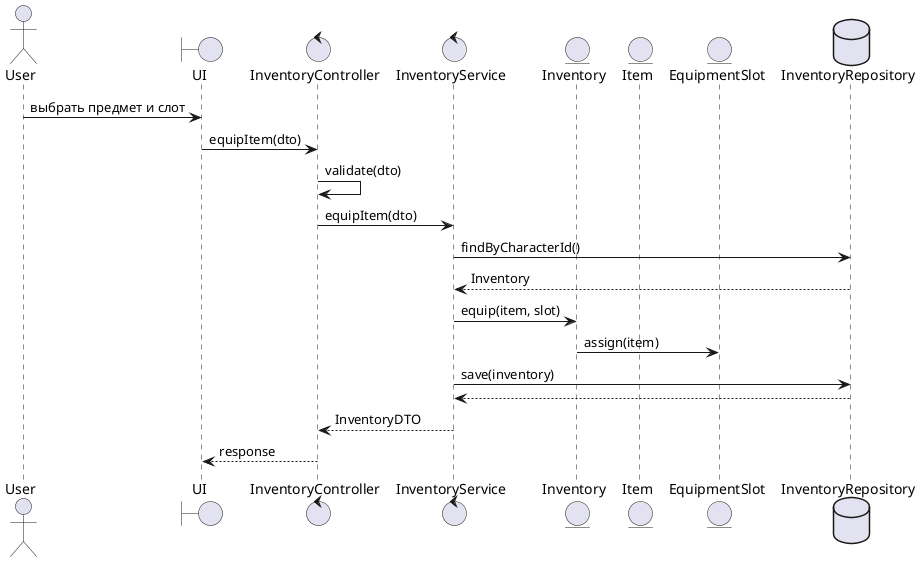
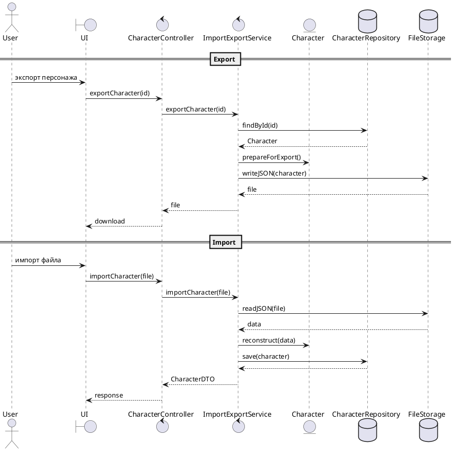

# Описание диаграмм последовательностей

## UC-03: Создание персонажа

Таблица 1 – Описание сценария UC-03

| Атрибут | Значение |
|--------|---------|
| Название | Создание персонажа |
| Актор | User |
| Описание | Пользователь создаёт нового персонажа с базовыми характеристиками |
| Слои | P, C, M, E, F |

Рисунок 1 – Диаграмма последовательности UC-03

---

## Описание

+ Пользователь инициирует создание персонажа через пользовательский интерфейс.
+ Контроллер принимает запрос и выполняет первичную валидацию DTO.
+ После успешной валидации запрос передаётся в слой Mediator (сервис).
+ Сервис формирует агрегат Character, включая инициализацию связанной сущности CharacterStats.
+ Выполняется установка базовых характеристик персонажа.
+ Сформированный агрегат сохраняется через репозиторий (слой Foundation).
+ После сохранения возвращается DTO с результатом операции.
+ Ответ передаётся обратно в UI.

### Особенности реализации

+ строго соблюдается направление зависимостей PCMEF;
+ бизнес-логика полностью изолирована в сервисе;
+ контроллер не содержит доменной логики;
+ используется агрегатный подход (Character как aggregate root);
+ обеспечивается расширяемость за счёт возможности добавления Builder/Factory в дальнейшем.

---

## UC-07: Управление инвентарём и экипировкой

Таблица 2 – Описание сценария UC-07

| Атрибут | Значение |
|--------|---------|
| Название | Управление инвентарём и экипировкой |
| Актор | User |
| Описание | Пользователь добавляет предмет в инвентарь и экипирует его в соответствующий слот |
| Слои | P, C, M, E, F |

Рисунок 2 – Диаграмма последовательности UC-07

---

### Описание

+ Пользователь инициирует экипировку предмета через UI, выбирая предмет и слот.
+ Контроллер принимает DTO и выполняет валидацию входных данных.
+ После валидации запрос передаётся в сервисный слой (Mediator).
+ Сервис загружает текущий инвентарь персонажа через репозиторий.
+ В доменной модели вызывается операция экипировки (equip).
+ Сущность Inventory делегирует назначение предмета соответствующему EquipmentSlot.
+ Выполняются проверки:
    * совместимость предмета и слота;
    * доступность слота;
    * ограничения по весу (overweight).
+ После изменения состояния агрегата выполняется сохранение через репозиторий.
+ Возвращается обновлённый DTO инвентаря.

### Особенности реализации

+ Inventory выступает агрегатным корнем для управления предметами;
+ логика экипировки инкапсулирована в доменной модели (Entity слой);
+ сервис выполняет координацию и транзакционное управление;
+ соблюдается строгая изоляция слоёв (Controller не содержит бизнес-логики);
+ реализована возможность расширения логики экипировки (например, эффекты предметов);
+ учитываются игровые ограничения (body zones, overweight, тип экипировки).

---

## UC-11: Импорт и экспорт персонажа

Таблица 3 – Описание сценария UC-11

| Атрибут | Значение |
|--------|---------|
| Название | Импорт/экспорт персонажа |
| Актор | User |
| Описание | Пользователь экспортирует персонажа в файл или импортирует его из файла |
| Слои | P, C, M, E, F |

Рисунок 3 – Диаграмма последовательности UC-11

---

### Описание

+ Пользователь инициирует экспорт или импорт персонажа через UI.
+ Контроллер принимает запрос и передаёт его в специализированный сервис импорта/экспорта.
+ При экспорте:
    * происходит загрузка агрегата Character из базы данных;
    * выполняется подготовка данных к сериализации;
    * данные записываются в JSON-файл через слой хранения.
+ При импорте:
    * файл считывается из хранилища;
    * выполняется десериализация в доменные объекты;
    * агрегат Character восстанавливается;
    * объект сохраняется в базе данных.
+ После завершения операции возвращается результат в виде DTO или файла.

### Особенности реализации

+ импорт/экспорт вынесен в отдельный сервис (Single Responsibility);
+ используется сериализация JSON для обеспечения offline-совместимости;
+ Character рассматривается как агрегатный корень при восстановлении;
+ обеспечивается изоляция между persistence и файловым хранилищем;
+ возможна реализация через паттерн Factory Method для создания объектов из JSON;
+ поддерживается offline режим desktop-клиента.
